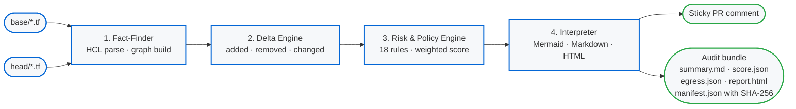

<div align="center">

# ArchiteX

### The Architecture Firewall for your Pull Requests

**Catch risky Terraform topology before it merges. Deterministic. Local. Free.**

[](https://github.com/danilotrix86/ArchiteX/releases)
[](https://github.com/danilotrix86/ArchiteX/actions/workflows/architex.yml)
[](https://go.dev)
[](LICENSE)
[](CONTRIBUTING.md)

[**Quickstart**](#-30-second-quickstart) ·
[**Live demo**](#-what-the-pr-comment-actually-looks-like) ·
[**Why ArchiteX?**](#-why-architex) ·
[**Coverage**](#-coverage) ·
[**Roadmap**](#-roadmap)

</div>

---

## What is this?

ArchiteX is a **drop-in GitHub Action** that reads the Terraform diff in a Pull Request and posts a deterministic architectural review back as a sticky PR comment. Every PR gets:

- A numeric **risk score** (0–10) with explainable reasons
- A **plain-English summary** of what changed and why it matters
- A **focused delta diagram** (Mermaid) showing only the changed nodes plus one layer of context
- An optional **CI gate** that can fail the build on critical violations
- A **timestamped audit bundle** with a self-contained HTML report and SHA-256 manifest

Everything runs on your own GitHub Actions runner. **Raw Terraform never leaves the runner.** No SaaS, no telemetry, no paid tier, no account.

> **v1.3 ships today** — 45 supported AWS resources, 18 risk rules, library-mode parsing for module-author repos, and a self-contained HTML report you can open in an air-gapped browser. [See the changelog →](CHANGELOG.md)

---

## ⚡ 30-second Quickstart

Add this file to your Terraform repo at `.github/workflows/architex.yml`:

```yaml
name: ArchiteX
on: pull_request
permissions:
  contents: read
  pull-requests: write
jobs:
  architex:
    runs-on: ubuntu-latest
    steps:
      - uses: danilotrix86/ArchiteX@v1.3.1
        with:
          terraform-dir: infra
```

**That's it.** Open a PR that touches `infra/*.tf`. ArchiteX will post a sticky comment with the score, the diagram, and the reasons. Nothing fails by default.

Want a CI gate that blocks merges on high-risk changes? Change one line:

```yaml
        with:
          terraform-dir: infra
          mode: blocking      # advisory (default) | blocking
```

[Full GitHub Action reference →](docs/github-action.md)

---

## 🎬 What the PR comment actually looks like

A developer opens a PR that adds a public ALB and changes a security group from private (`10.0.0.0/16`) to public (`0.0.0.0/0`). ArchiteX posts:

> ### ❌ Risk Level: HIGH (9.0/10 — higher means more risk)
>
> Status: **fail** · Severity: **high**
>
> #### Plain-English Summary
>
> This change introduces significant architectural risk. 1 node was added, 1 node was changed, and 2 edges were added. A new entry point (`aws_lb.web`) was added, increasing the public attack surface. A security-related resource (`aws_security_group.web`) was modified, which may affect access control policies.
>
> #### Suggested Review Focus
>
> - **Exposure** (weight 4.0): A resource changed from private to public — confirm the CIDR allow-list was intended.
> - **Exposure** (weight 3.0): A new entry point was added — confirm authentication and TLS are configured.
> - **Data exposure** (weight 2.0): Public exposure was introduced alongside an access-control change.
>
> #### Delta Diagram
>
> ```mermaid
> flowchart LR
>     classDef added stroke:#28a745,stroke-width:2px
>     classDef changed stroke:#d39e00,stroke-width:2px
>     classDef context stroke:#6c757d,stroke-width:1px
>
>     aws_lb_web["+ entry_point: aws_lb.web"]:::added
>     aws_security_group_web["~ access_control: aws_security_group.web"]:::changed
>     aws_subnet_public["network: aws_subnet.public"]:::context
>
>     aws_lb_web -->|attached_to| aws_security_group_web
>     aws_lb_web -->|deployed_in| aws_subnet_public
> ```
>
> #### Policy Result
>
> - **exposure** `public_exposure_introduced` (4.0)
> - **exposure** `new_entry_point` (3.0)
> - **data_exposure** `potential_data_exposure` (2.0)
>
> ---
> _Generated by ArchiteX (deterministic mode)._

Every byte above is **deterministic**. The same diff produces byte-identical output across runs, machines, and contributors.

---

## 🤔 Why ArchiteX?

Static-analysis tools tell you _which line_ has a problem. ArchiteX tells you _what changed in your architecture_ and _why a reviewer should care_.

| | **ArchiteX** | tfsec / Trivy | Checkov | Terraform Cloud |
|---|---|---|---|---|
| **Deterministic output** (byte-identical re-runs) | ✅ | ⚠️ partial | ⚠️ partial | ❌ |
| **Architectural delta** (added/removed/changed) | ✅ | ❌ | ❌ | ⚠️ plan-only |
| **Mermaid diagram in PR comment** | ✅ | ❌ | ❌ | ❌ |
| **Plain-English summary for non-experts** | ✅ | ❌ | ❌ | ❌ |
| **Library-mode parsing** (`count = var.x ? 1 : 0`) | ✅ | ❌ | ⚠️ | ⚠️ |
| **Baseline anomaly detection** | ✅ | ❌ | ❌ | ❌ |
| **Self-contained HTML audit report** | ✅ | ❌ | ❌ | ❌ |
| **Air-gap friendly** (no SaaS, no telemetry) | ✅ | ✅ | ✅ | ❌ |
| **Free + open source** | ✅ | ✅ | ✅ | ❌ |
| **Single binary, single Action, zero config** | ✅ | ✅ | ⚠️ | ❌ |

ArchiteX **complements** rule-based scanners. Run them side-by-side: tfsec catches misconfigured-line issues; ArchiteX catches *architectural* drift (new entry points, novel resource types, conditional gates a reviewer might miss).

---

## 🏗 How it works



Every stage is **fully deterministic**. The Interpreter is template-based — no inference, no model calls, no network. The same input produces byte-identical output across runs. See [master.md](master.md) for the full architecture specification.

---

## 🆕 What's new in v1.3

- **EKS, Auto Scaling, RDS-groups support** — `aws_eks_cluster`, `aws_eks_node_group`, `aws_eks_addon`, `aws_eks_fargate_profile`, `aws_eks_identity_provider_config`, `aws_db_subnet_group`, `aws_db_parameter_group`, `aws_db_option_group`, `aws_launch_template`, `aws_autoscaling_group`, `aws_autoscaling_policy`. **45 AWS resources total.**
- **3 new risk rules** — `eks_public_endpoint`, `eks_no_logging`, `asg_unrestricted_scaling`. **18 deterministic rules total.**
- **Library mode** — opt-in parser mode for module-author repos. Resources gated behind `count = var.create ? 1 : 0` (and `length(var.x) > 0 ? 1 : 0`) are now materialized as **conditional phantoms** marked `?` in the diagram. Risk rules refuse to score them, so phantoms never produce false positives. Enable in `.architex.yml`:
  ```yaml
  parser:
    mode: library     # consumer (default) | library
  ```
- **Selftest hardening** — every fixture (Tranche-1, Tranche-2, Tranche-3, library-mode) is a regression check in CI. Anything that quietly changes the rendered output now fails the build.

[Full v1.3 changelog →](CHANGELOG.md)

---

## 📦 Coverage

**45 AWS resource types**, organized into a small set of abstract architectural roles:

| Family | Resources | Since |
|---|---|---|
| **Network** | `aws_vpc`, `aws_subnet`, `aws_internet_gateway`, `aws_nat_gateway`, `aws_route53_zone`, `aws_route53_record` | v1.0 – v1.2 |
| **Access control** | `aws_security_group`, `aws_security_group_rule`, `aws_network_acl`, `aws_network_acl_rule`, `aws_s3_bucket_public_access_block`, `aws_s3_bucket_policy`, `aws_sns_topic_policy`, `aws_sqs_queue_policy`, `aws_db_parameter_group`, `aws_db_option_group` | v1.0 – v1.3 |
| **Compute** | `aws_instance`, `aws_lambda_function`, `aws_ecs_cluster`, `aws_ecs_service`, `aws_ecs_task_definition`, `aws_eks_cluster`, `aws_eks_node_group`, `aws_eks_addon`, `aws_eks_fargate_profile`, `aws_launch_template`, `aws_autoscaling_group`, `aws_autoscaling_policy` | v1.0 – v1.3 |
| **Entry points** | `aws_lb`, `aws_lambda_function_url`, `aws_apigatewayv2_api`, `aws_cloudfront_distribution` | v1.0 – v1.2 |
| **Data** | `aws_db_instance`, `aws_sns_topic`, `aws_sqs_queue`, `aws_secretsmanager_secret` | v1.0 – v1.2 |
| **Storage** | `aws_s3_bucket`, `aws_ebs_volume` | v1.1 – v1.2 |
| **Identity** | `aws_iam_role`, `aws_iam_policy`, `aws_iam_role_policy_attachment`, `aws_kms_key`, `aws_kms_alias`, `aws_eks_identity_provider_config` | v1.1 – v1.3 |
| **Network (specialized)** | `aws_db_subnet_group` | v1.3 |

Unsupported resource types emit a warning and slightly reduce the confidence score — they never cause failures.

The parser also expands **local module recursion**, **literal `count` / `for_each` / `dynamic` blocks**, **`data.aws_iam_policy.x.arn` resolution**, and **`jsonencode({...})` policy bodies** — see [docs/github-action.md](docs/github-action.md) for the full surface.

### 18 deterministic risk rules

Each rule contributes a fixed weight (capped at 10.0). Reviewer-facing names are stable across versions.

| Rule | Weight | Triggers when… | Since |
|---|---:|---|---|
| `public_exposure_introduced` | 4.0 | A node's `public` attribute changes from `false` to `true`. | v1.0 |
| `s3_bucket_public_exposure` | 4.0 | An `aws_s3_bucket_public_access_block` is removed, OR a permissive bucket policy is added. | v1.1 |
| `eks_public_endpoint` | 3.5 | An `aws_eks_cluster` is added with `vpc_config.endpoint_public_access = true` and **no** CIDR allow-list. | v1.3 |
| `iam_admin_policy_attached` | 3.5 | A role policy attachment binds `AdministratorAccess` or `IAMFullAccess`. | v1.1 |
| `messaging_topic_public` | 3.5 | An added SNS/SQS policy has `Allow … Principal = "*"`. | v1.2 |
| `nacl_allow_all_ingress` | 3.5 | A NACL rule allows `0.0.0.0/0` ingress with literal `allow`. | v1.2 |
| `new_entry_point` | 3.0 | An added node has abstract type `entry_point`. | v1.0 |
| `lambda_public_url_introduced` | 3.0 | A `lambda_function_url` is added (layers on `new_entry_point`). | v1.1 |
| `ebs_volume_unencrypted` | 3.0 | An EBS volume has explicit literal `encrypted = false`. | v1.2 |
| `new_data_resource` | 2.5 | An added node has abstract type `data`. | v1.0 |
| `cloudfront_no_waf` | 2.5 | A CloudFront distribution is added with no `web_acl_id`. | v1.2 |
| `potential_data_exposure` | 2.0 | `public_exposure_introduced` fires alongside a data/access-control change. | v1.0 |
| `eks_no_logging` | 1.5 | An EKS cluster is added with no `enabled_cluster_log_types`. | v1.3 |
| `first_time_abstract_type` | 1.5 | A new abstract type appears in the repo for the first time. | v1.2 |
| `first_time_resource_type` | 1.0 | A new Terraform type appears for the first time. | v1.2 |
| `asg_unrestricted_scaling` | 1.0 | An ASG with `max_size > 100` and no `min_size` floor. | v1.3 |
| `resource_removed` | 0.5 | A node was removed (capped at 2 reasons). | v1.0 |
| `first_time_edge_pair` | 0.5 | A new (provider-type, provider-type) edge appears for the first time. | v1.2 |

**Library-mode phantoms are never scored.** A resource gated behind `count = var.create ? 1 : 0` carries `Attributes["conditional"] = true`; every per-resource rule short-circuits on it. The diagram still shows the phantom (prefixed with `?`) so reviewers can see the conditional intent without false positives.

---

## ⚙️ Configuration (optional)

Drop a `.architex.yml` at the root of your Terraform directory to tune the engine. Every field is optional; an absent file reproduces v1.2 behavior bit-for-bit.

```yaml
parser:
  mode: library              # consumer (default) | library  -- v1.3

rules:
  iam_admin_policy_attached:
    weight: 5.0              # bump default 3.5 -> 5.0
  s3_bucket_public_exposure:
    enabled: false           # silence the rule entirely

thresholds:
  warn: 3.0                  # >= warn -> medium / warn (default 3.0)
  fail: 7.0                  # >= fail -> high / fail (default 7.0)

ignore:
  paths:
    - "**/legacy/**"         # parser skips matching .tf files

suppressions:
  - rule: lambda_public_url_introduced
    resource: aws_lambda_function_url.maintenance
    reason: "Maintenance lambda; auth type is AWS_IAM"
    expires: "2026-12-31"    # expired entries still drop the rule
                             # but get an (EXPIRED) flag in the PR comment
```

You can also place inline directives directly above a resource block:

```hcl
# architex:ignore=s3_bucket_public_exposure reason="Static docs site, intentional"
resource "aws_s3_bucket_policy" "docs" {
  ...
}
```

Suppressed findings are **never silent**: they appear in a dedicated **Suppressed Findings** section in the PR comment with their reason and source.

### Baseline anomaly detection

The three `first_time_*` rules consume an optional `.architex/baseline.json` snapshot that records the *kinds* of resources, abstract types, and edge pairs your repo has ever contained — no raw HCL, no resource names. Generate or extend it with:

```bash
architex baseline ./infra            # writes ./infra/.architex/baseline.json
architex baseline ./infra --merge    # union with the existing snapshot
```

Commit the baseline alongside your Terraform. From then on, novel additions surface as low-weight signals that **layer on top** of the existing rules — a brand-new public CloudFront in a repo that has never had an entry point scores `new_entry_point` (3.0) + `first_time_abstract_type` (1.5) + `first_time_resource_type` (1.0) = **5.5** instead of 3.0.

---

## 💻 Local CLI usage

```bash
# Build once
go build -o architex .

# Build the graph for a Terraform directory
./architex graph ./infra/

# Semantic delta between two snapshots
./architex diff ./base ./head

# Risk evaluation
./architex score ./base ./head

# Full PR-ready Markdown report (+ audit bundle with HTML report)
./architex report ./base ./head --out ./.architex/

# Sanitized egress payload (the only bytes that would leave a runner)
./architex sanitize ./base ./head --salt my-salt

# Post the report as a sticky PR comment (the ONLY network call)
GITHUB_TOKEN=ghp_xxx ./architex comment ./.architex/<bundle>/ \
  --repo my-org/my-repo --pr 42 --mode advisory
```

---

## 🔒 Trust model

- **Analysis runs locally on the runner.** Parsing, graph construction, delta, risk evaluation, and Markdown rendering all happen in the `architex` binary. No `.tf` source is transmitted anywhere.
- **The only network call is the PR comment.** `architex comment` POSTs the rendered Markdown to the GitHub REST API using `GITHUB_TOKEN`. That's the same token your other workflow steps already have.
- **The audit bundle is always uploaded.** Every run produces a timestamped bundle (`diagram.mmd`, `summary.md`, `score.json`, `egress.json`, `report.html`, `manifest.json` with SHA-256 checksums) uploaded as a workflow artifact. `report.html` is a single self-contained page with no JavaScript, no CDN scripts, and no remote fonts — open it in an air-gapped browser and see the full report.

See [master.md §6](master.md#6-trust-model-and-data-sanitization) for the full trust model, sanitization controls, and egress specification.

---

## 🗺 Roadmap

- **v1.0** — Canonical 3-tier AWS scope (VPC, subnets, SGs, EC2, ALB, RDS).
- **v1.1** — AWS Top 10 expansion (S3, IAM, Lambda, API Gateway v2). 17 resources, 8 rules.
- **v1.2** — Depth & configurability: parser depth (modules, count, for_each, dynamic), `.architex.yml`, baseline anomaly detection, self-contained HTML report. 34 resources, 15 rules.
- **v1.3** — *(this release)* EKS + Auto Scaling + RDS groups, library-mode parsing, conditional-phantom rendering, hardened selftest. **45 resources, 18 rules.**
- **Future** — Multi-provider support (Azure / GCP first), GitLab + Bitbucket adapters, non-Terraform IaC. See [master.md §8](master.md#8-scope-and-roadmap).

---

## 🤝 Contributing

See [CONTRIBUTING.md](CONTRIBUTING.md) for setup, what kinds of PRs are welcome, and the design principles that guide the project.

The single best ways to help:

1. **Open an Issue** describing your use case, a Terraform pattern that didn't parse correctly, a rule you wished existed, or a false positive that hurt trust.
2. **Open a Discussion** for broader design questions and proposals.
3. **Open a Pull Request** with tests if you have a fix or an additive feature.

---

## 📄 License

[MIT](LICENSE) — use, modify, and distribute freely, including in commercial settings.

<div align="center">

**Built for reviewers who'd rather see one diagram than scroll through a 600-line plan.**

⭐ Star the repo if ArchiteX saved you a code review.

</div>
