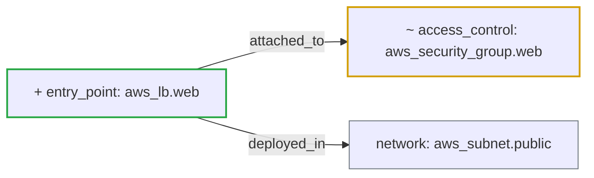

## [FAIL] Risk Level: HIGH (9.0/10 &mdash; higher means more risk)

Status: **fail** &middot; Severity: **high**

_Detected providers: aws &mdash; 8 resources analyzed._

## Plain-English Summary

Added 1 entry-point resource. Modified 1 access-control resource. Connectivity changed: 2 new dependency edges. A previously private resource is now publicly accessible, increasing the blast radius of this change.

## Suggested Review Focus

- Confirm that public exposure is intended on aws_security_group.web and that ingress is restricted to required ports and sources.
- Review the new entry point(s) aws_lb.web for TLS, authentication, and exposure scope.
- Trace the new public path to any data resource and confirm it is not reachable from the internet.

## Delta Diagram

## Policy Result

- **[EXPOSURE]** `public_exposure_introduced` (weight 4.0) &mdash; Resource aws_security_group.web became publicly accessible.
- **[EXPOSURE]** `new_entry_point` (weight 3.0) &mdash; New public entry point aws_lb.web introduced.
- **[DATA_EXPOSURE]** `potential_data_exposure` (weight 2.0) &mdash; Public exposure introduced in presence of data resources or security-related changes. Review potential data exposure risk.

---
_Generated by ArchiteX (deterministic mode)._
