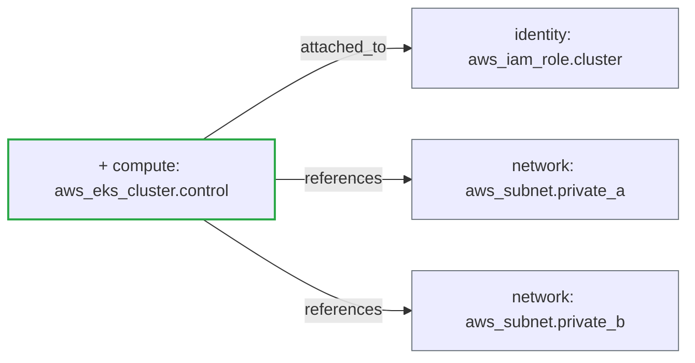

## [WARN] Risk Level: MEDIUM (5.0/10 &mdash; higher means more risk)

Status: **warn** &middot; Severity: **medium**

_Detected providers: aws &mdash; 5 resources analyzed._

## Plain-English Summary

Added 1 compute resource. Connectivity changed: 3 new dependency edges.

## Suggested Review Focus

- Restrict the EKS API endpoint on aws_eks_cluster.control via vpc_config.endpoint_public_access_cidrs, or set endpoint_public_access = false and access through a private link.
- Enable enabled_cluster_log_types on aws_eks_cluster.control (api, audit, authenticator are the bare minimum) so control-plane activity is forensically auditable.

## Delta Diagram

## Policy Result

- **[EXPOSURE]** `eks_public_endpoint` (weight 3.5) &mdash; EKS cluster aws_eks_cluster.control exposes a public API endpoint with no CIDR allow-list; restrict via vpc_config.endpoint_public_access_cidrs.
- **[OBSERVABILITY]** `eks_no_logging` (weight 1.5) &mdash; EKS cluster aws_eks_cluster.control has no enabled_cluster_log_types; control-plane activity will not be auditable.

---
_Generated by ArchiteX (deterministic mode)._
