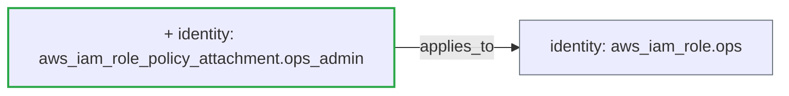

## [WARN] Risk Level: MEDIUM (3.5/10 &mdash; higher means more risk)

Status: **warn** &middot; Severity: **medium**

_Detected providers: aws &mdash; 2 resources analyzed._

## Plain-English Summary

Added 1 identity resource. Connectivity changed: 1 new dependency edge.

## Suggested Review Focus

- Audit the privilege grant on aws_iam_role_policy_attachment.ops_admin -- AdministratorAccess / IAMFullAccess gives root-equivalent control to anyone who assumes the role.

## Delta Diagram

## Policy Result

- **[IDENTITY]** `iam_admin_policy_attached` (weight 3.5) &mdash; IAM attachment aws_iam_role_policy_attachment.ops_admin grants AdministratorAccess; review for privilege escalation.

---
_Generated by ArchiteX (deterministic mode)._
