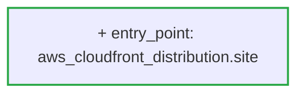

## [WARN] Risk Level: MEDIUM (5.5/10 &mdash; higher means more risk)

Status: **warn** &middot; Severity: **medium**

_Detected providers: aws &mdash; 2 resources analyzed._

## Plain-English Summary

Added 1 entry-point resource.

## Suggested Review Focus

- Review the new entry point(s) aws_cloudfront_distribution.site for TLS, authentication, and exposure scope.
- Add an AWS WAF (web_acl_id) to aws_cloudfront_distribution.site before merging; CloudFront edges without a WAF expose the origin to every L7 attack pattern.

## Delta Diagram

## Policy Result

- **[EXPOSURE]** `new_entry_point` (weight 3.0) &mdash; New public entry point aws_cloudfront_distribution.site introduced.
- **[EXPOSURE]** `cloudfront_no_waf` (weight 2.5) &mdash; CloudFront distribution aws_cloudfront_distribution.site was introduced without a WAF (web_acl_id); add AWS WAF to mitigate L7 attacks at the edge.

---
_Generated by ArchiteX (deterministic mode)._
