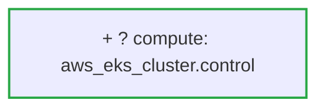

## [OK] Risk Level: LOW (0.0/10 &mdash; higher means more risk)

Status: **pass** &middot; Severity: **low**

_Detected providers: aws &mdash; 3 resources analyzed._

## Plain-English Summary

Added 1 compute resource.

## Suggested Review Focus

- No risk rules triggered. Review the change for intent and naming consistency.

## Delta Diagram

## Policy Result

- No policy violations triggered.

---
_Generated by ArchiteX (deterministic mode)._
