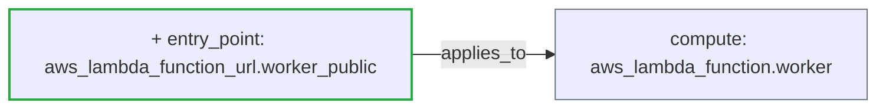

## [WARN] Risk Level: MEDIUM (6.0/10 &mdash; higher means more risk)

Status: **warn** &middot; Severity: **medium**

_Detected providers: aws &mdash; 3 resources analyzed._

## Plain-English Summary

Added 1 entry-point resource. Connectivity changed: 1 new dependency edge.

## Suggested Review Focus

- Inspect the Lambda function URL aws_lambda_function_url.worker_public for authorization_type, IAM auth, and (ideally) WAF coverage; public Function URLs bypass API Gateway entirely.
- Review the new entry point(s) aws_lambda_function_url.worker_public for TLS, authentication, and exposure scope.

## Delta Diagram

## Policy Result

- **[EXPOSURE]** `lambda_public_url_introduced` (weight 3.0) &mdash; Public Lambda function URL aws_lambda_function_url.worker_public was introduced; verify auth type and WAF coverage.
- **[EXPOSURE]** `new_entry_point` (weight 3.0) &mdash; New public entry point aws_lambda_function_url.worker_public introduced.

---
_Generated by ArchiteX (deterministic mode)._
