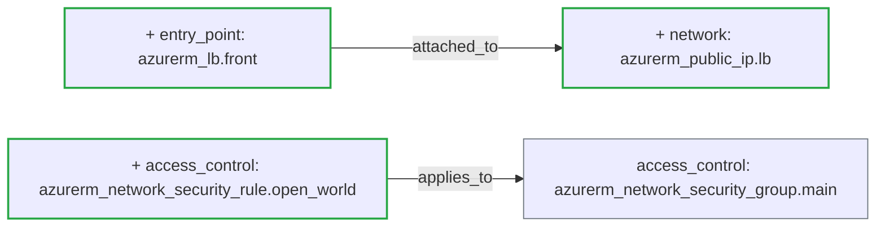

## [WARN] Risk Level: MEDIUM (6.5/10 &mdash; higher means more risk)

Status: **warn** &middot; Severity: **medium**

_Detected providers: azurerm &mdash; 7 resources analyzed._

## Plain-English Summary

Added 1 access-control resource, 1 entry-point resource, and 1 network resource. Connectivity changed: 2 new dependency edges.

## Suggested Review Focus

- Tighten the NSG rule azurerm_network_security_rule.open_world; an Allow inbound from "*" / 0.0.0.0/0 opens the subnet at the network layer regardless of any tighter NSG rule above it.
- Review the new entry point(s) azurerm_lb.front for TLS, authentication, and exposure scope.

## Delta Diagram

## Policy Result

- **[EXPOSURE]** `nsg_allow_all_ingress` (weight 3.5) &mdash; Network security rule azurerm_network_security_rule.open_world allows inbound traffic from *; the subnet is open at the network layer.
- **[EXPOSURE]** `new_entry_point` (weight 3.0) &mdash; New public entry point azurerm_lb.front introduced.

---
_Generated by ArchiteX (deterministic mode)._
